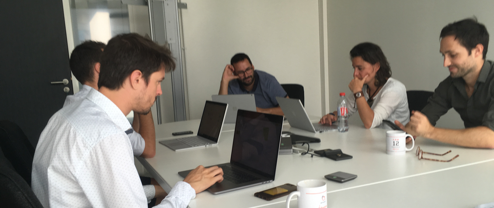

# Comète

- ### Team
- [Emotic](http://emotic.fr)
- [Théo Geiller / Product design](#)

- ### Timeline
- July 2019 - October 2019

- ### Role
- User interface
- Visual design
 

- ### Tools
- Sketch
- InVision

- ### Methodology
- Sprint

During my latest internship at <a href="http://emotic.fr" target="_blank">Emotic</a>. I joined the comete team for learn how to design and conceive digital product for metier needs.

 ---

## Context

I was involved in 3 sprints for a metier app. For this project i choose to show a speed overview of app and to explain sprints i have participate.

### Impact

it's the first time i design for a real users, i like that because we have a lot of data and workshop for understand context and real needs of users.

> 17,948 Users

> 74.374 Pages view per month

> 3 Metiers

## Sprint 11 : Home & Search 

During this sprint, I had to build a user interface compliant with the SNCF's design system, I add to the platform more contrast thanks to the card that stands out from the background. I also adapt the design system to the project.

### update design system

This sprint was very satisfying because I was able to show and explain my screens to the SNCF team in charge of the "Comète" project.
Demonstrating my choices effectively allowed me to take into account the changes in accessibility.

## Sprint 12 : A/B Testing + Design system

For this sprint, the Comete team wanted to challenge its navigation and home screen. Sébastien (UX at emotic) asked me to develop a screen for A/B tests for future user test workshops.

I would also create a design system based on the sncf's one which will easily be added to the comet project. 

## Sprint 13 : Onboarding

the last sprint I'll ever see will focus on onboarding. I was in charge of updating the user interface and simplifying it.

I chose to simply enhance onboarding with illustrations. The Comete team was enthusiastic about these choices and my work was implemented in the product.

