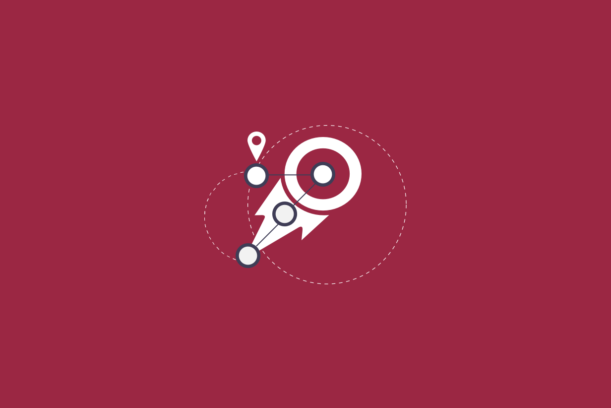
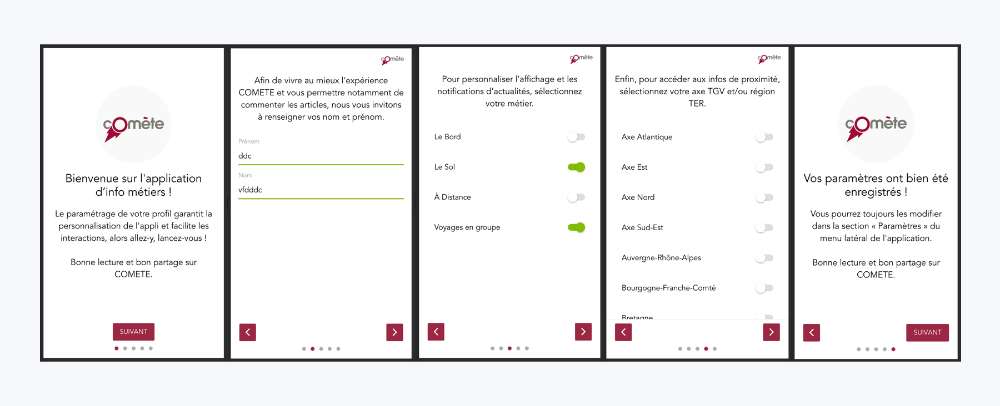

# Comète
## Overview

During my latest internship at <a href="http://emotic.fr" target="_blank">Emotic</a>. I joined the comete team for learn how to design and conceive digital product for metier needs.

- ### Team 
- [Emotic](http://emotic.fr)
- [Théo Geiller / Product design](#)

- ### Timeline
- 4 months

- ### Role
- User researcher
- Interaction design
- Product design
 
- ### Tools
- Paper / pencil
- Sketch
- Invision
- Gitlab
- Vue/Angular/Dialogflow

## Context

I was involved in 3 sprints for a metier app. For this project i choose to show a speed overview of app and to explain sprints i have participate.

### Impact

it's the first time i design for a lot of users, i like that because we have a lot of data and workshop for understand context and real needs of users.

> 17,948 Users

> 74.374 Pages view per month

> 3 Metiers

## Sprint 11

During this sprint i have to build powerful user interface in accordance with SNCF design system

### Before

### After

this sprint was very satisfying because i have to show my screen to the client and demonstrate my ux choice for allow us to take into consideration my evolution.
these evolution was in production at the end of my internship.

## Sprint 12

for this sprint Comete's team wanted to change navigation. Sebastien (Emotic ux designer) ask me to developp screen for A/B testing during co-conception workshop.

## Sprint 13

### Before

### After

Last sprint are Onboarding oriented for me.

My task : simplify onboarding.

After a lot of test i choose to improve Onboarding with undraw illustration. This choice have sucess on Comete's team
