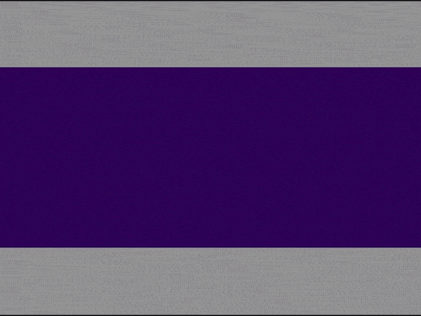
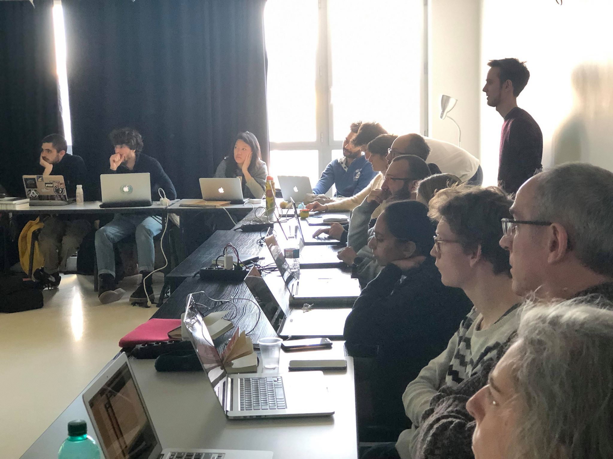

# Creative codding

## 42 school
During summer 2018, I went to 42 school for learning basics imperative programmation with C language.
I have experimented with peer-to-peer pedagogy, based on computer practice. 
Every day for four weeks, as well as at weekends, I had exercises or computer projects to do,
report and evaluate, while meeting other 42 students.
### Skills
- Programming
- Stamina at work (1 month / 15 hours a day)
- Adaptability to the work environment
- Autonomy

## Patatap

2018

### Skills
- Art direction
- Pedagogy in code (I helped and explain some principles to my classmates)

blablabla Try it > [Patatap](https://ateliernum.github.io/projet_patatap_1819/Geiller_Th2o/index.html)

## VOID

2018

### Skills
- Art direction
- User journey
- Group project
- Programming 

<iframe src="https://player.vimeo.com/video/315148421" width="100%" height="360" frameborder="" allow="autoplay; fullscreen" allowfullscreen></iframe>

1 week Workshop project with processing, creation of a micro-organism, who living thanks to internet connections and data that surround us.

Also tangible creative codding, with mapping and soundscape.
During this workshop, I learned to collaborate better because we did not have the time. 
There needed to be clear direction and goals.

## PROCESSING COMMUNITY DAY

2019

Teaching creative codding during 1 day.
After experiments and have strong basic knowledge in imperative codding / creative codding, I had the opportunity
to exchange and animate a workshop of 25 participants

### Skills
- Speaking
- Empathy

I appreciate this experience because I love exchange knowledge and meet people arround my field, 
I enjoyed preparing a github course to let our participant explore and continue to create creative codding after our course

[Github Course](https://ateliernum.github.io/projet_patatap_1819/Geiller_Th2o/index.html)

