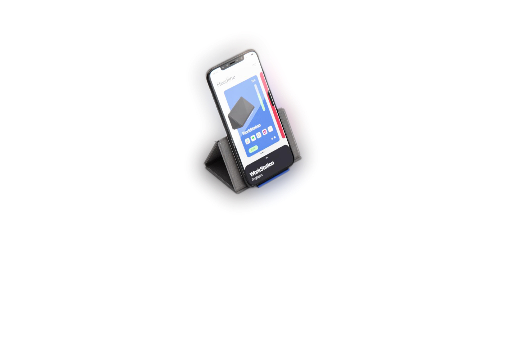
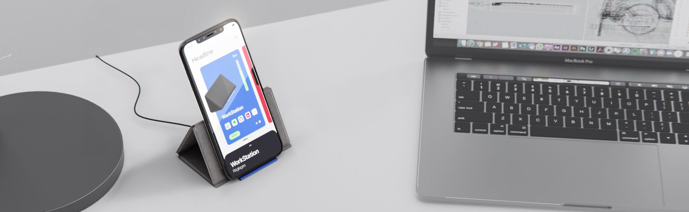
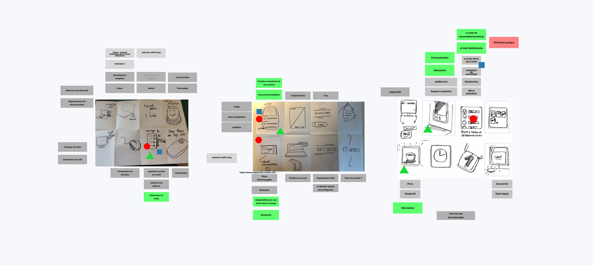
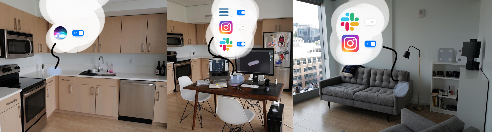

# Smartimer of galaxy

- ### Team
- [Pierre-Damien Doucet / Industrial design](https://pierredoucet.com/)
- [Théo Geiller / Product design]()

- ### Timeline
- June 2020

- ### Role
- Interaction Designer
- UX/UI Designer

- ### Tools
- Sketch
- Principle
- After Effect
- Premiere Pro

- ### Methodology
- Persona
- Crazy height
- 

Switch to focus mode and reduce smartphone interruptions by blocking your distracting applications with a dock containing rfid technology.

 ---

# Context

During the containment, I managed the organization of an event within the school, HACKARANTAINE is a hackathon on discord and my role was to make contact with mentors/potential participants, I was in charge of the whole upstream phase of the event. I then decided to participate as the rest of the collective that was in charge of the event did not need any reinforcement. After the hackarantaine I decide with an industrial design student to continue to think around this project and we will make a video prototype 

# video prototype
<iframe class="video" width="560" height="315" src="https://www.youtube.com/embed/7p8mKIXvY3c" frameborder="0" allow="accelerometer; autoplay; encrypted-media; gyroscope; picture-in-picture" allowfullscreen></iframe>

# HACKARANTAINE - 48h

- ### hackarantaine team
- [Ines Le Bihan / Industrial design](https://ineslebihan.com/)
- [Astoria Diarra / Industrial design](https://www.behance.net/AstoriaDIARRA)
- [Pierre-Damien Doucet / Industrial design](https://pierredoucet.com/)
- [Noemie El Kholti / Product design]()
- [Théo Geiller / Product design]()

## problem statement

As a user I would like to improve my habits, to get into my workflow

## Crazy height & Dot voting

## Concept

With SmartDock, we want to connect real space to a digital space. Create a natural link between what you can do with our smartphone and the real life context.

I made this image to demonstrate the use to our Hackarantaine mentor, <a target="_blank" href="https://alexandredeffenain.com/">Alexandre deffenain</a>

