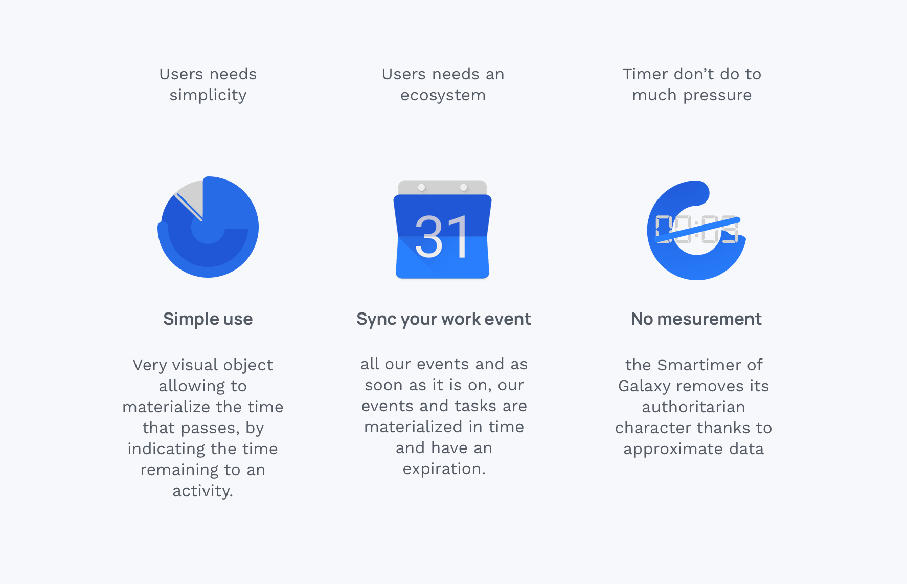
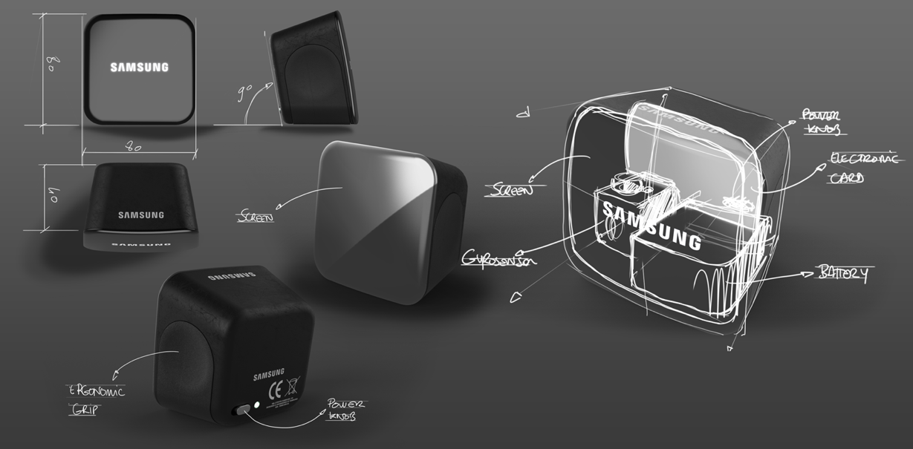

# Smartimer of galaxy

- ### Team
- [Pierre-Damien Doucet / Industrial design](https://pierredoucet.com/)
- [Théo Geiller / Product design]()

- ### Timeline
- 48 hours

- ### Role
- Product designer
- UX/UI Designer
- Interaction Designer

- ### Tools
- Sketch
- Kanban Board
- Adobe Illustrator
- Adobe Photoshop

- ### Methodology
- Persona
- Storyboard

Smartimer of Galaxy is a very visual object allowing to materialize the time that passes, by indicating the time remaining to an activity. it also provides an opportunity to learn how to manage it while implementing self-regulation.

 ---

# Context

I was involved with a friend in Samsung Mobile Design Competition. For this entry, the brief was simple. The goal was to create a new little object device for Samsung. We decided to participate and create this concept in 24 hours. I took care of of the whole interface and reflection around this subject that we chose, I also tried to help on the product's shape for the interactions it could offer. Pierre Damien Doucet took care of the formal design, modeling and rendering of the connected object.

# Process Overview 

# Hero Render

# Concept

> "With the timer, everyone stays on track and we produce a ton of ideas"     -      Tina Chen, Product Designer at Medium

I have confronted by my internship to the world of work. despite my position at <a target="_blank" href="https://www.emotic.fr/">Emotic</a> 
the contrast between school project and internship project inspire me to work on project management. 

targets primarily the professional world and more particularly employees of companies where schedule means meeting,
rapid prototyping, creative workshop, ticket resolution, development, sprint or workshop. Companies, project managers, 
freelancer and lead managers will find it of enormous interest, they will be able to get to know better the working habits of 
their employees, for a more appropriate framework. They will also be able to carry out their project and have a real vision of 
their employees' time.

# ideate

A task is completed before the scheduled time ? Smartimer of Galaxy adapts to our user with simple interactions

Smartimer of Galaxy is a very visual object allowing to materialize the time that passes, by indicating the time remaining to an activity. 
it also provides an opportunity to learn how to manage it while implementing self-regulation. It brings urgency and efficiency to the task of our user : For meeting, rapid prototyping, creative workshop, simple tasks, workshop. Using the principle of the timer, the Smartimer of Galaxy removes its authoritarian character thanks to approximate data and by removing precise measurement. Smartimer of Galaxy is connected to our calendar and all our events and as soon as it is on, our events and tasks are materialized in time and have an expiration.
A task is completed before the scheduled time ? Smartimer of Galaxy adapts to our user with simple interactions: just flip it on the right side to move on to the next event in your calendar ! Go back to your previous task by just flipping it to the left ! Want a break ? Put the screen on the table to put the timer on hold ! At the end of your day you will get a glimpse of your real schedule and will improve the way you plan your schedule.

