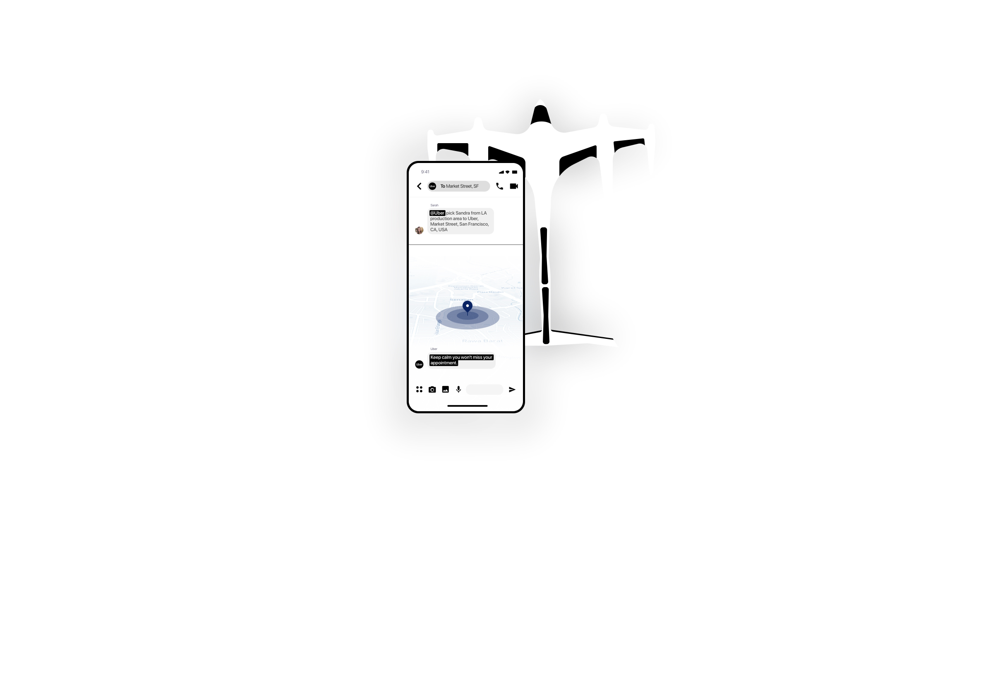
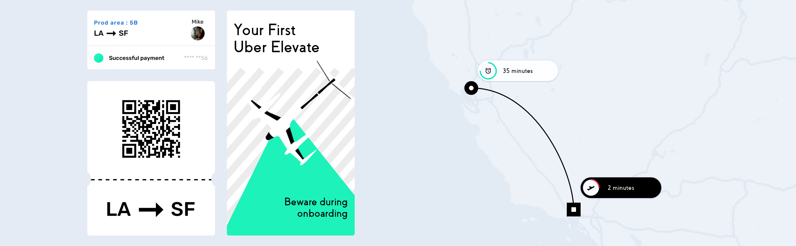

# Uber Elevate + Messenger

- ### Team
- [Théo Geiller / Product design](#)

- ### Timeline
- November 2019 - June 2020

- ### Role
- User interface design

- ### Tools
- Sketch
- Principle
- Premiere Pro

- ### Methodology
- Technological watch

This video experimentation allows me to link two services, it also brings a new look at our messaging applications with the possible implementation of third party applications that link by use.

 ---

# context

For my interface animation course, I had to work on the theme of aviation. After some research, I ended up being absorbed by reruns of the <a target="_blank" href="https://www.uber.com/fr/fr/elevate/summit/">"Summit" events</a> organized by <a target="_blank" href="https://www.uber.com/fr/fr/elevate/">Uber Elevate</a>. My teacher wanted us to start from an existing video and add interfaces. So I chose the demonstration video <a target="_blank" href="https://www.youtube.com/watch?time_continue=1&v=JuWOUEFB_IQ&feature=emb_title">"UBERAIR: closer than you think | Uber"</a> from Uber to add my concept of connecting Messenger and Uber Elevate through interfaces and animation.

 
# Video prototype

<iframe class="video" width="560" height="315" src="https://www.youtube.com/embed/8mv9LHPTF98" frameborder="0" allow="accelerometer; autoplay; encrypted-media; gyroscope; picture-in-picture" allowfullscreen></iframe>

