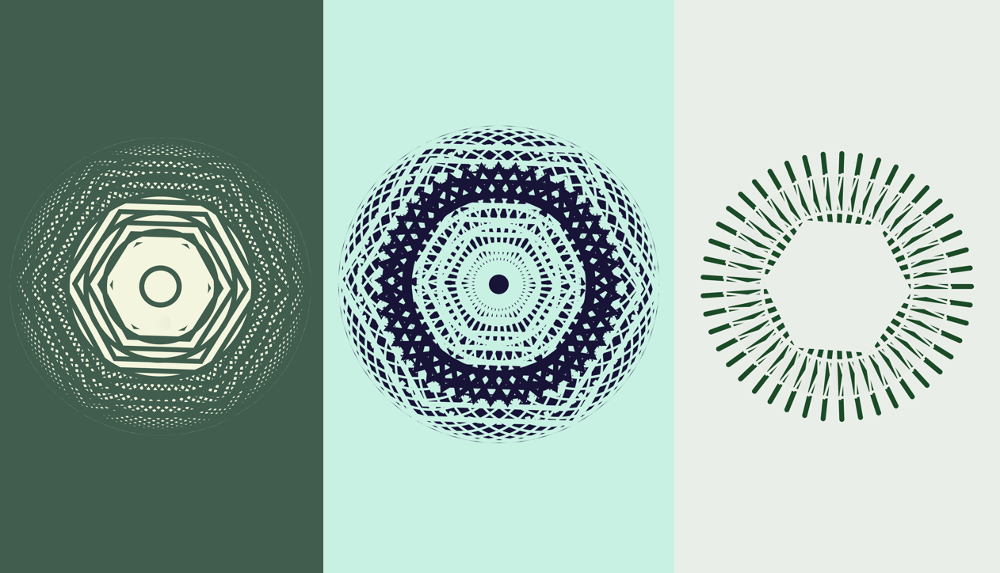
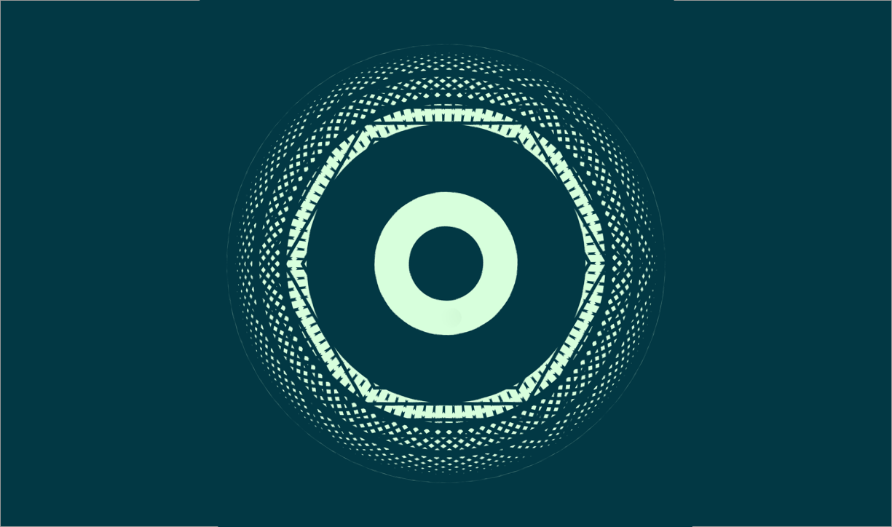
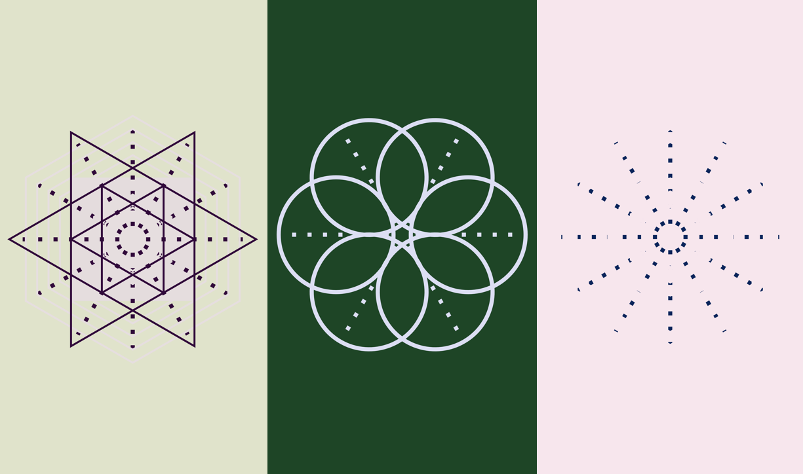

# Unique

During summer 2019, after a year full of creative codding experiments, I experiments a lot with vue.js and want to became better in software prototype in order 
to build minimum vaillable product or proof of concept more faster with web language.

### Skills
- Software prototyping
- Empathy

It's nice to see a lot of difference between all the generated forms.

## Software Prototype

<iframe class="proto"
        width="320"
        height="568"
        src="https://theojkydbz.github.io/vue-unique/"></iframe>

<a class='center mobileview' target="_blank" href="https://theojkydbz.github.io/vue-unique/">Mobile Prototype</a>

## Some of my others training with vue.js

I learn myself how build spa, pwa with dynamic content. I have learn some backend basis with node.js.
I am also able to manage npm project with command line interface. 
I have learned a lot about all technical stack in production, and talk with a lot of developpers about their practice.
Without losing sight of my designer goals and methodology.

Exercice/training by <a target="_blank" href="https://github.com/Jerga99">Filip Jerga</a> :

<iframe class="proto"
        width="320"
        height="568"
        src="https://theojkydbz.github.io/vue-todo/"></iframe>

<a class='mobileview' target="_blank" href="https://theojkydbz.github.io/vue-todo/">Mobile Prototype</a>

<iframe class="proto"
        width="420"
        height="568"
        src="https://theojkydbz.github.io/vue-activity/"></iframe>

<a class='mobileview' target="_blank" href="https://theojkydbz.github.io/vue-activity/">Mobile Prototype</a>

