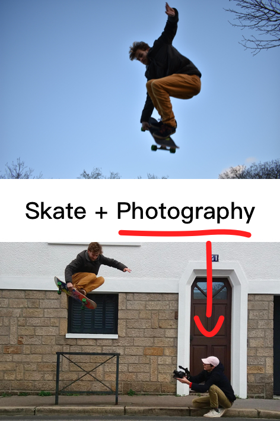
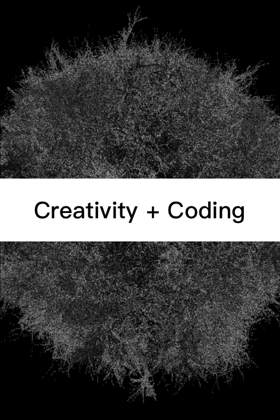
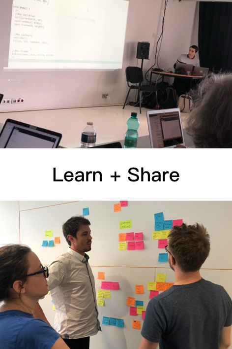
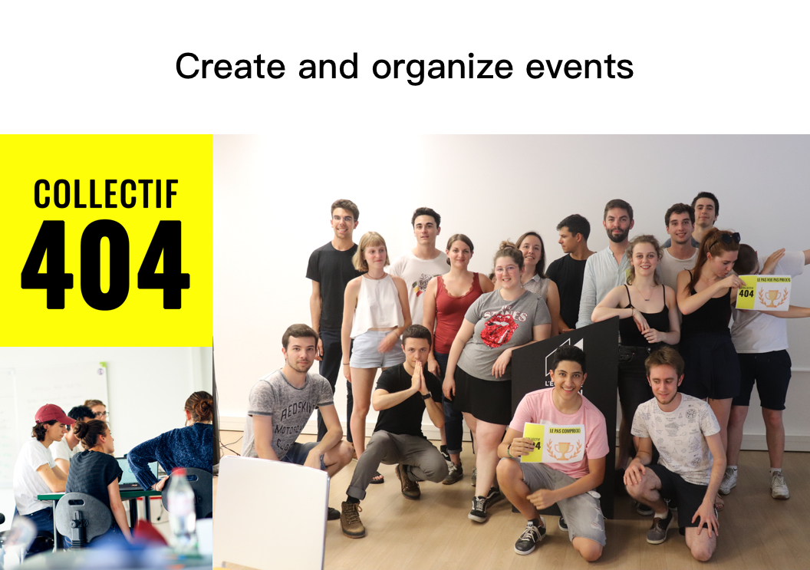

<h1 class="title">How to guide a learning path through professional relationships ? A discussion-based application that improves the relationship between the student and the professional.</h1>

- ### Team
- [Théo Geiller / Product design](#)

- ### Timeline
- November 2019 - June 2020

- ### Role
- User research
- Product design
- Information architecture

- ### Tools
- Paper / pencil
- Sketch
- MarvelApp
- OptimalWorkshop
- Blender

- ### Methodology
- Interview
- Return of experience
- Card sorting
- Co-creation workshop
- Semiotic square
- User flow

Confluence is a junction. A space in which students, former students and professionals meet, work and discuss. It also opens up new possibilities for the transmission of knowledge in order to have a more natural learning path.

 ---

 
# Context

This project began from my passion for learning and my passive observations during my study and my experience of self-education, from my journey at <a target="_blank" href="https://www.42.fr/">42</a> computer programming school to the <a target="_blank" href="https://openlearning.mit.edu/courses-programs/mitx-courses-edx">MITx</a> online course i'm following. At <a target="_blank" href="https://www.lecolededesign.com/">lecolededesign</a>, I manage the <a target="_blank" href="https://www.lecolededesign.com/">collectif404</a> with which I like to organize conferences and hackathons in order to create a learning transmission between students.

 

# Adaptive pedagogy

Multi-methodology research

Thanks to my curiosity, I have conducted research on pedagogy in general. The interview of Laurent Neysensas head of teaching innovation unit at <a target="_blank" href="https://www.lecolededesign.com/">lecolededesign</a>, <a target="_blank" href="https://blog.richardmillwood.net/2013/05/10/learning-theory/">the learning theory v6 schema</a> by <a target="_blank" href="http://richardmillwood.net/">Dr Richar Millwood</a> and my experiences in several types of pedagogy will make me reflect about the fact that we all need a different pedagogical pattern.

Also i discover that concept exist, it's call adaptive learning

How i can help adaptive pedagogy make a learning path more fluid ?

# Problem

Communication technologies are increasingly being adopted by institutes and universities to improve learning systems. Through adaptability in the pedagogical environment, the learner would have access to personalized interactions, continuous monitoring of progress and facilitation of engagement in his learning.

Knowledge is everywhere, but we must understand it and put it into practice.

## Definition

To understand the subject we must understand two keys definition into pedagogy :

Explicit vs constructivism pedagogy definition

## Our learning paths
> "Thy time like this thou shalt divide: A third in the unknown thou shalt go, Two thirds the steps of others thou shalt follow"

<a target="_blank" href="https://www.cairn.info/revue-reseaux-2010-2-page-225.htm#">Gerd Gigerenzer</a> - director emeritus of the Center for Adaptive Behavior and Cognition (ABC) at the Max Planck Institute for Human Development

Gerd Gigerenzer permit me to understand that former students and the professional sphere can be very useful in my concept because they have an influence on the subject (the learner).

Metaphor of the user's environment

this metaphor leads me to my final problem.

> How to guide a learning path through professional relationships ?

Bachelor project problematic

# Insights

# Use case

Former students and Professional Problems/Solutions

Student Problems/Solutions

# Concept refinement

Using use cases and insights based on my 2 users I start to define the concrete objectives of the application.

## Aim of the project

1. Limiting a learner's frustrations through coaching

2. Bringing sharing between students and professionals

3. Guiding the student towards discovery through practice

# Information architecture

Information architecture process

From my list of objectives, I was able to analyze the different types of users with a semiotic square. I led a co-creation workshop with a student that allows me to collect the kind of data that makes sense in this context for students.

Understand & collect data

With the data that makes sense to students, I was able to create an ontology of the ecosystem, this categorization helps me to better understand design issues

Organize data

# Design

Design process

In order to prototype efficiently, I started with a paper prototype and did my first test on a paper version

## Paper prototype

My room wall, full of prototype

During containment, I used a wall in my room to display all versions and user flow so that I could make informed decisions that move me forward.

Here are some of my boards synthesizing my progress or enlightening my decisions :

### Meeting

To have contacts in the application to work with, to ask for help, you have to participate in "Mentor Dating" in video-conversation. These "Mentor Dating" are short video exchanges of 5 minutes that let the sympathy/personal side speak more and not only the skills/professional side. This allows you to see who you would like to be in contact with as a Mentor/Student.

### Discussion

Once the meeting is complete, the mentor and student can be added. They then have an environment designed for factual/rapid exchange and resource sharing.

[v1] Low-fidelity core experiences

### Navigation

The 2 tab bar is the best solution because it highlights the two main functions of the product, meeting or exchanging with a contact.

[v1.2] Navigation test

[v1.2] Low-fidelity core experiences

Once my userflows were confirmed and nested by paper prototype, I could see much more clearly in the features present, some disappear for lack of meaning and others gain momentum

## Userflow

This user flow is based on the ontology of my ecosystem, it establishes a correlation between the information displayed and the actions of the users.

Userflow

 This low-fidelity model on "sketch" allows me to 

1) Fix & clean my paper mock-ups

2) Precisely manage the layout, spaces/margins.

3) Conditionally test

Low-fidelity mock-ups

## Visual design

App logo design

App character design

## High-fidelity

High-fidelity core experiences

### Issue story

The student will dare to ask for help with orientation, professional choices or recommendations on his or her practices thanks to the "Issue Story" feature. It allows him to ask a question or a problem in the form of stories that the mentor will be able to answer easily.

### Don't disturb

The professional has a quick tool for managing notifications to avoid being disturbed by messages.

High-fidelity notifications manager

### Private Meeting

Organizations and companies can create "Mentor Dating" salons. They will provide a code that will allow their employees/members and students to log in.

## UI design & Micro interaction
<iframe class="video" width="560" height="315" src="https://www.youtube.com/embed/gxPStVZ8iAM" frameborder="0" allow="accelerometer; autoplay; encrypted-media; gyroscope; picture-in-picture" allowfullscreen></iframe>

# Conclusion

Our two interlocutors will be linked in a relationship that goes beyond the simple professional world. It opens up new possibilities for the transmission of knowledge in order to have a more natural learning path composed with human relation, contact and exchange

It's the first time I've gone so deeply into the information architecture in a project, I really liked using these principles because I feel that the information and the structure of the product are intertwined.

I put aside many aspects of pedagogy such as feedback and data visualization, this could be an improvement to consider.

