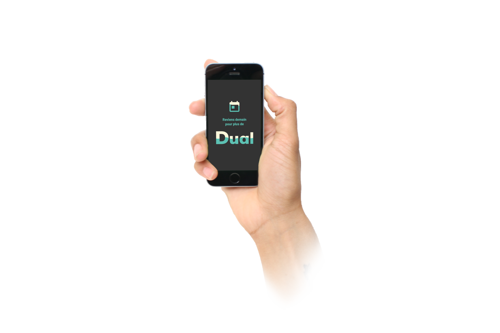

</img>
# Dual

Project with [Elliot Chevalier](http://elliotchevalier.com/)

People want to give their opinion for their city ad neigborhood

[See the brief](http://elliotchevalier.com/)

The brief was a good concept and my classmates and me be enthusiasm for solving this product.
we have a lot of brainstorming to understand how people can be interested to change their city when they walk or be on their way.

User want to be shocked ! in today marketing campaigns the mass destruct all campaign with no powerful and relevant offer or content.
On our way we decided to work a relevant identity with powerful for make people use our services. 
For more we don't want to take attention for take attention. we want to integrate this attention into our user journey 
and our service became a ritual.

We have explore a lot of usage, with storie's and actual things who divert our attention