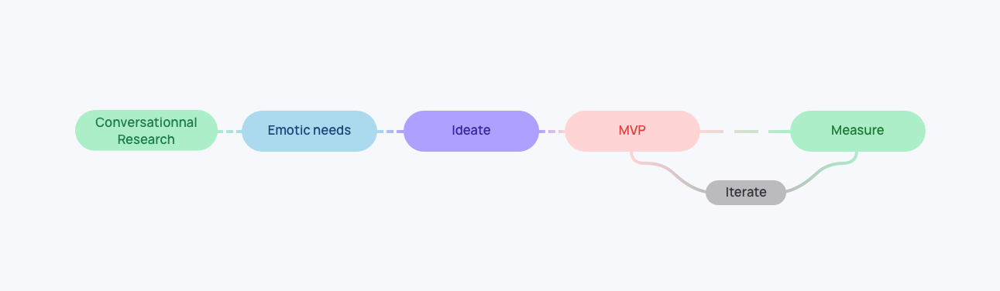
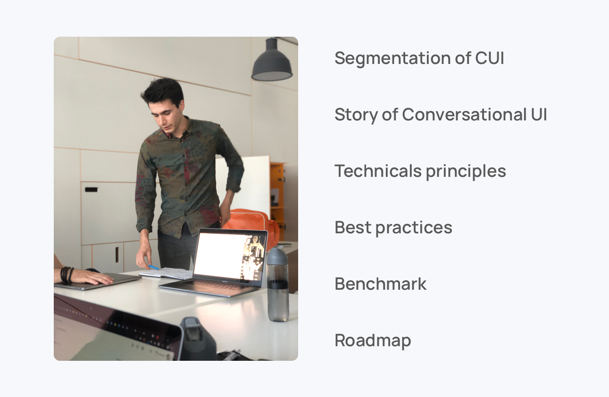
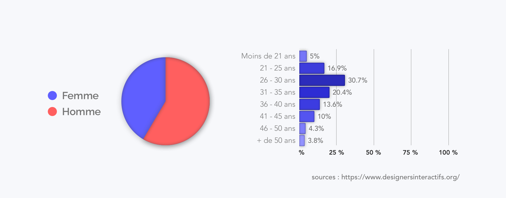
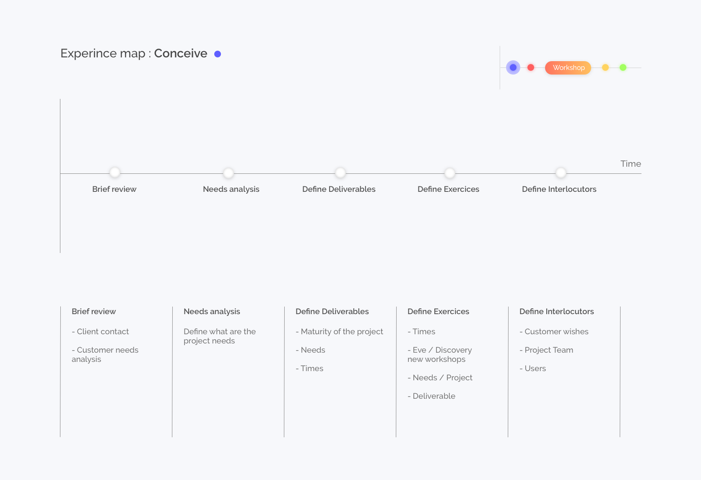
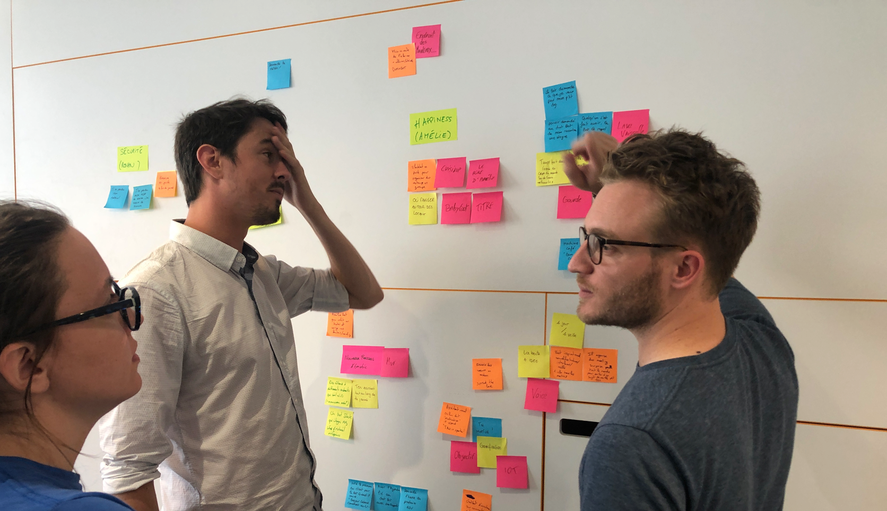
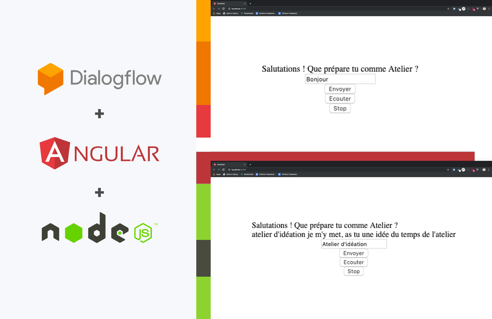
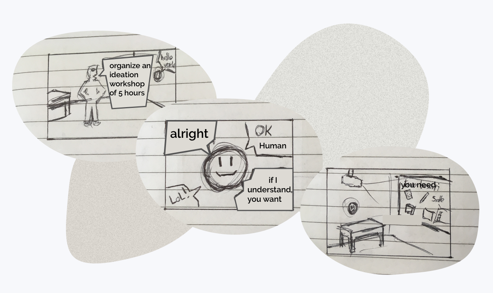
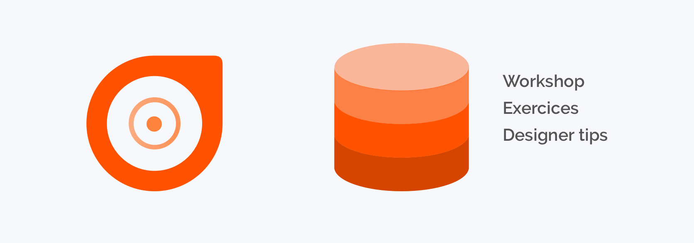

# Emorkshop
## Overview
I have to experiment and conceive an internal product with conversational user interface during my latest internship at [Emotic](http://emotic.fr).
I choose to push a mvp to give more impact for my product and help my colleague to 
- ### Team 
- [Emotic](http://emotic.fr)
- [Théo Geiller / Product design](#)

- ### Timeline
- 2 months

- ### Role
- User researcher
- Interaction design
- Product design
 
- ### Tools
- Paper / pencil
- Sketch
- Invision
- Gitlab
- Vue/Angular/Dialogflow

## Process Overview 

## Software Prototype
It's my latest proof of concept that demonstrates use cases! [French]
<iframe class="proto" src="https://player.vimeo.com/video/372134182" width="640" height="360" frameborder="0" allow="autoplay; fullscreen" allowfullscreen></iframe>
<a class='mobileview' target="_blank" href="https://player.vimeo.com/video/372134182">Prototype video</a>

## Conversationnal Research

I made some research for better understand Conversationnal & Voice User Interface in order to build better product and present my research to Emotic team : [Full Research](https://www.pearltrees.com/theojkydbz/conversationnel/id25545738)

I also wrote a [benchmark article](https://emotic.fr/blog/comparaison-agents-conversationnels-comprendre-interactions-entre-humain-et-intelligence-artificielle/) for Emotic blog

## Task
Improve UX designer workshop workflow using conversationnal 

## Define
###  UX designer workshop
Co-creation workshop an field of Ux goals are to undersatnd needs of user / customer in order to build an adapted experience this is characterized by vulgarization of conception principe in order to co-conceive tools with principal users
###  Conversational agent
Set of interactions similar to an exchange in natural language with a device able to take action, able to act

## Context
Workshop animation and UX Design are recent disciplines create tool for these field are an opportunity to improve rentability, efficacity and conditions of designers.

Today ux field are abstract and during co-creation workshop designer have to be focus at 100% on his audienceand forget his slide support

## User Interview

## User Journey

Emotic ux designer have a workplace, they prepare workshop with G-suite. Workshop have an average timing of 4-5 hours, workshop preparation became a repetitive task and designer spend more time producing slides than thinking and discovering new exercises

## Ideate

## Road to minimum viable product

## Measure

in progress

## Conclusion

I have learn a lot with this project because i have to demonstrate clearly the value and impact of my project to my colleague and developper in order to have real developper help on the mvp.
I'm very enthousiast about this project because Ux designer of Emotic have demonstrate a real interest for my project