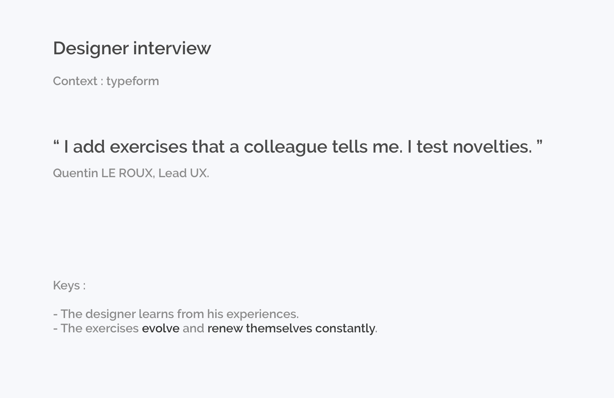
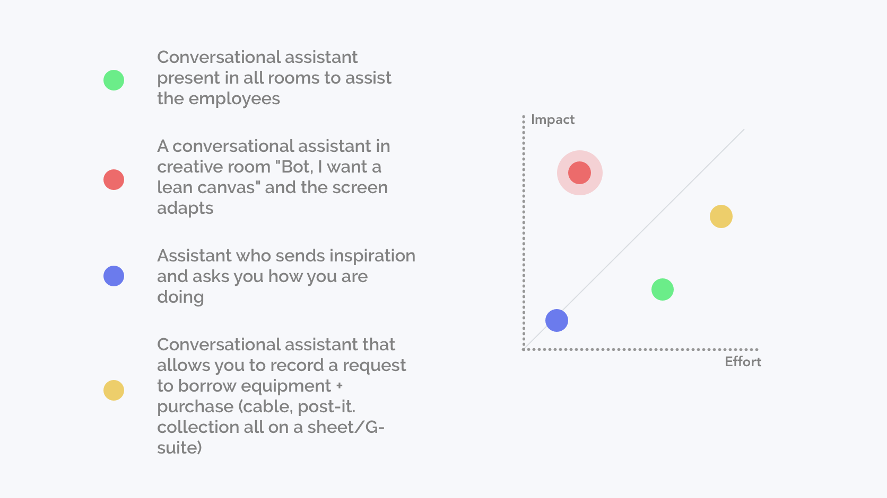
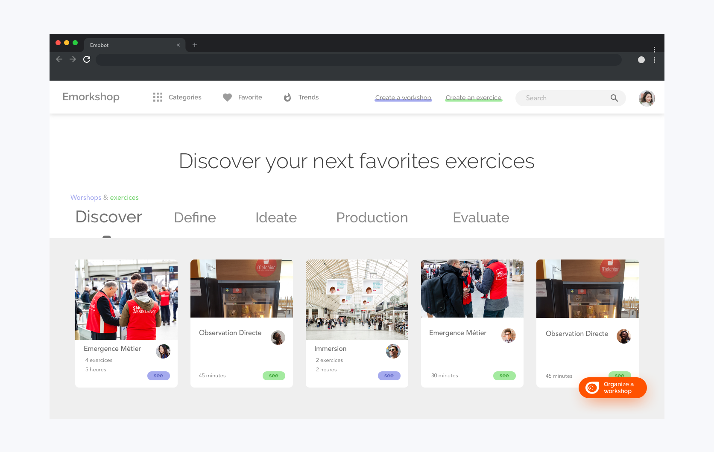

# Emorkshop

- ### Team 
- [Emotic](http://emotic.fr)
- [Théo Geiller / Product design](#)

- ### Timeline
- 2 months

- ### Role
- User research
- Interaction design
- Product design
 
- ### Tools
- Paper / pencil
- Sketch
- InVision
- Gitlab
- Vue / Angular / Dialogflow
 ---
## Overview

I had to experiment and conceive an internal product with conversational user interface during my latest internship at <a href="http://emotic.fr" target="_blank">Emotic</a>.
 

As a powerful company in Nantes' technology ecosystems, Emotic wanted to take ownership of conversational interface product design. 
It's a buzzword in Nantes' digital industry today. But it's a technology that is about to revolutionize many things in our daily lives.

As an intern, when I wasn't busy with client projects, I had to experiment and document the subject of conversational interfaces.

I then designed an internal product based on needs identified within the design team.
At the end of my internship my product sparked interest and time was given to a developer to build a minimum viable product with me.

## Process Overview 

## Software Prototype

Simple, with help of a bot you can create a workshop and spend time on reflexion instead of creating slides.
The bot creates all your slides and help you to think about the supplies you don't want to forget.

This video demonstrates the use of the latest concept :

<iframe class="proto" src="https://player.vimeo.com/video/372134182" width="640" height="360" frameborder="0" allow="autoplay; fullscreen" allowfullscreen></iframe>

<a class='mobileview marge' target="_blank" href="https://player.vimeo.com/video/372134182">Prototype video</a>

## Research

I did a lot of research to understand the conversational and vocal interface in order to build a better product and present my <a href="https://www.pearltrees.com/theojkydbz/conversationnel/id25545738" target="_blank">research</a> to the Emotic team : 

I also wrote a <a href="https://emotic.fr/blog/comparaison-agents-conversationnels-comprendre-interactions-entre-humain-et-intelligence-artificielle/" target="_blank">benchmark article</a> for Emotic blog

## Task

My role was to improve UX designer workshop workflow using conversationnal interface

 
###  UX designer workshop

Co-creation workshop is a field of UX. The goals are to understand needs of users/customers in order to build an adapted experience. UX workshops are characterized by vulgarization of conception principle, to co-conceive tools with principal users

###  Conversational agent

Set of interactions similar to human exchange with a device able to take action, able to act

## Context

Workshop animation and UX Design are recent disciplines. creating a tool for these fields is an opportunity to improve rentability, efficacity and conditions of designers.

>Today the UX field is abstract and during co-creation workshops, the designer has to be focused at 100% on his audience and forget his slide support

## User Interview

## User Journey

Emotic UX designers have a workplace, they prepare workshops with Google-suite. Workshops have an average timing of 4-5 hours, workshop preparation became a repetitive task and designers spent more time producing slides than thinking and discovering new exercises

Emobot concentrates on the slide's production phase, leaving the designer time to focus on understanding the needs and objectives and therefore on the conception of his workshop.

## Ideate

I was able to lead my first workshop as a student designer, to better understand what workshops creation was all about and thus understand their needs and frustrations.

>The conversational interface adapts to the user's context through usage and mediums.

Our workshop idea :

## Road to minimum viable product

I wanted to create a minimum viable product to test and improve my solution.

My conversational agent needs to gather a lot of exercises and workshops in order to propose them to the users.

I created a platform to create workshop documentation, all designers can connect to the platform to create workshops, exercises, improve them as the content evolves very quickly and new workshop formats appear every month.

## Measure

in progress

## Conclusion

I learned a lot with this project because I had to clearly demonstrate the value and impact of my project to my fellow designers and developers.
I am very excited about this project because the UX designers at Emotic have shown a real interest in my project.
