# EPO
## Overview

- ### Team 
- [Aurore Tanguy / Product design]()
- [Théo Geiller / Product design](#)

- ### Timeline
- 2 months

- ### Role
- Product designer
- User Researcher
- UX/UI Designer
- Interaction Designer
 
- ### Tools
- Paper / pencil !
- Sketch
- Invision
- Github
- HTML/CSS/JS
- Adobe Illustrator
 ---
## Process Overview 
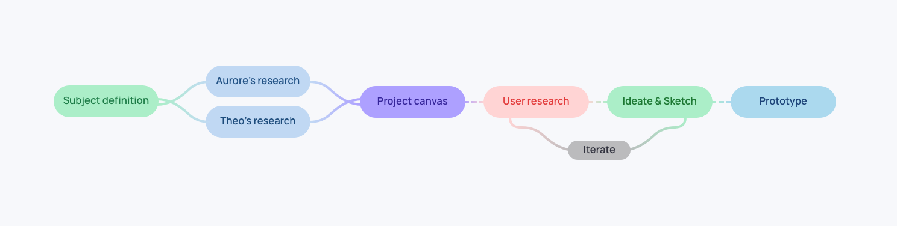

## Software Prototype

It is our latest prototype that demonstrates our use cases!

<iframe class="proto"
        width="340"
        height="588"
        src="https://theojkydbz.github.io/ProjetLong/#list"></iframe>

<a class='mobileview' target="_blank" href="https://theojkydbz.github.io/ProjetLong/">Mobile Prototype (optimized for Iphone SE)</a>

## Context

> 99.2% of individuals have an information medium
[cairn.info](https://www.cairn.info/revue-reseaux-2010-2-page-225.htm#)

Why are we interested in the information:

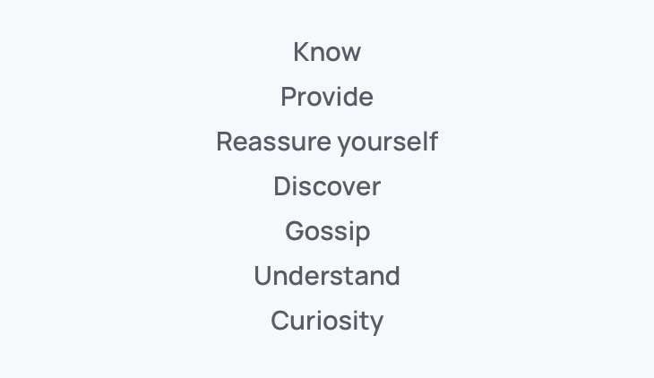

Social media has a responsibility to reflect reality.

## Concept

Today all information is given with intent. People want develop their view point to reach their verity

> How to detach the bias of a journalistic article to allow the user to form his opinion ?

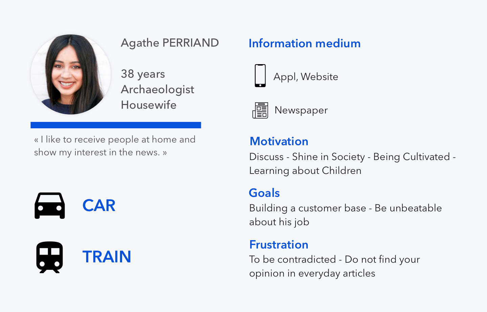

> By the use of time, how to allow the user to inform himself and confront his ideas ?

### Description

A service whose function is to gather journalistic articles so that each user can interpret them 
and make his opinion, as well as give his opinion.
An app with a time feature to decrease infobesity.

### Expectations

Users want to share their opinion and have a confrontation in divergent opinions.
Being informed in a reliable and regular way is the priority in the application.
While being able to verify the information.

## Ideate 

### Goals
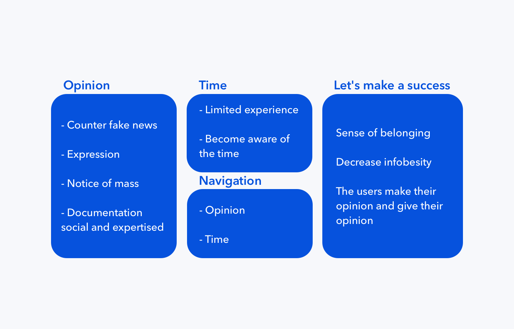

### Low fidelity

We have reach a use case with a kind of playlist builder to time experience of user

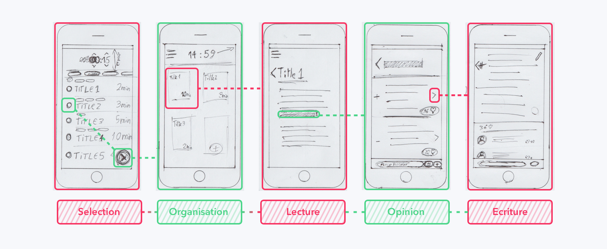
### Iterate

Also, tried to improve our pencil paper models as much as possible before moving on to the high fidelity prototyping

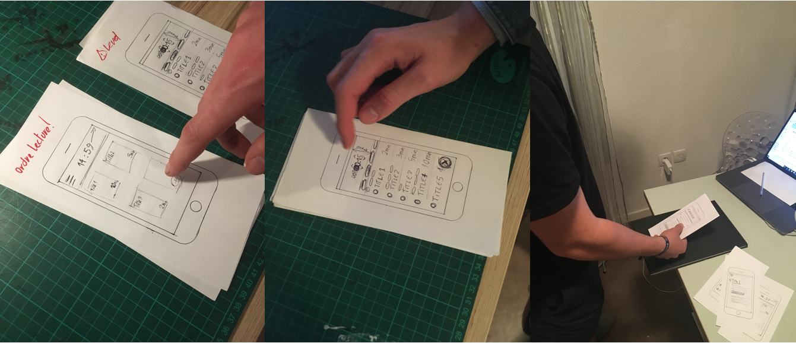

## Oriented Object User Experience

In order to build a better information architecture, I mapped the entire application architecture to understand
where and in what form the interface components are used

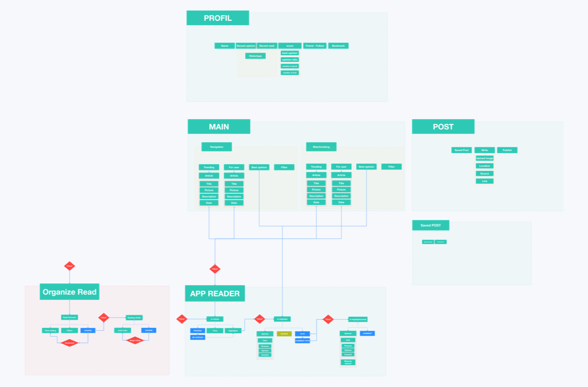

The main component is the article, so I prioritize information that has a better impact on our users.

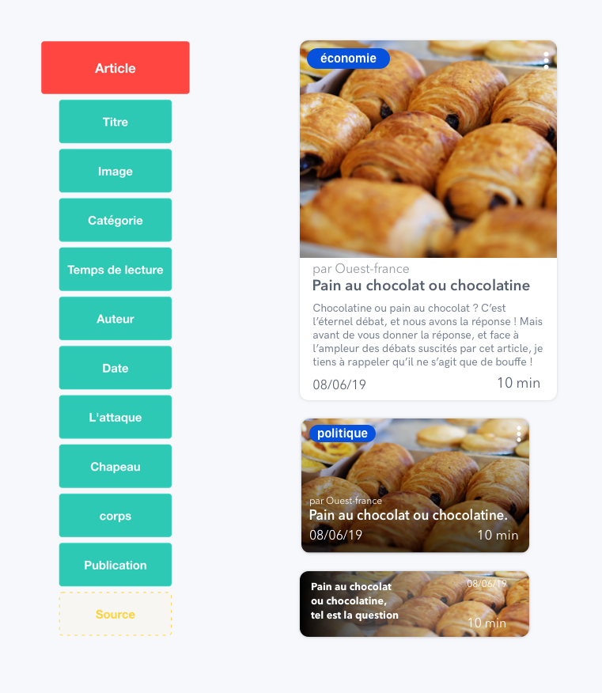

## Logo Design
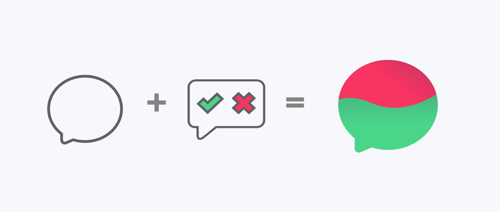

- E = elefthería (grec) = freedom (en)
- P = pliroforíes (grec) = information (en)
- O = óra (grc) = time (en) 

## Prototype

### High fidelity

Timer send you alert signal for stop our reading.

### Technical stack
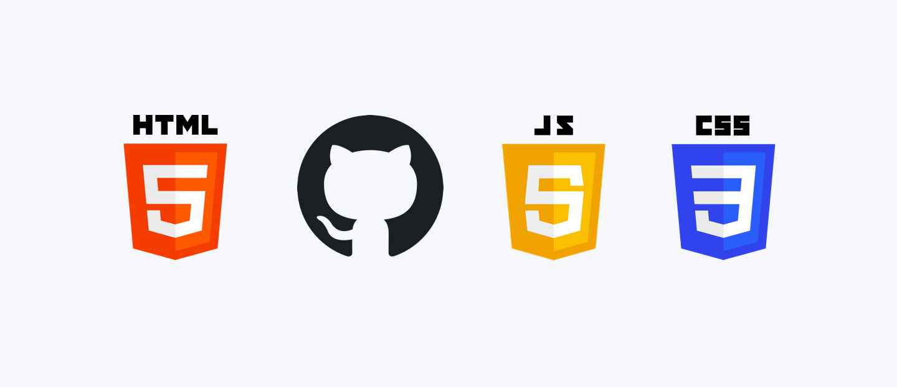

## Iterate
### User tests

We decided to test during the morning our high fidelity prototype on people on the bus.

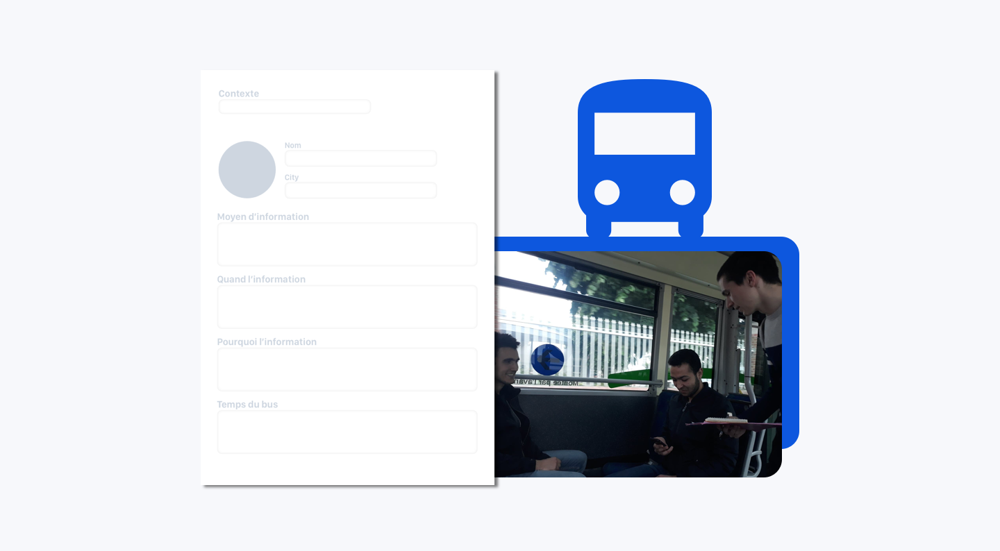

## Conclusion

We have tackled a very difficult problem and I think social networks are a very complex field. so I think I need to explore and better understand this field because connecting people across distance and other constraints is really exciting.

