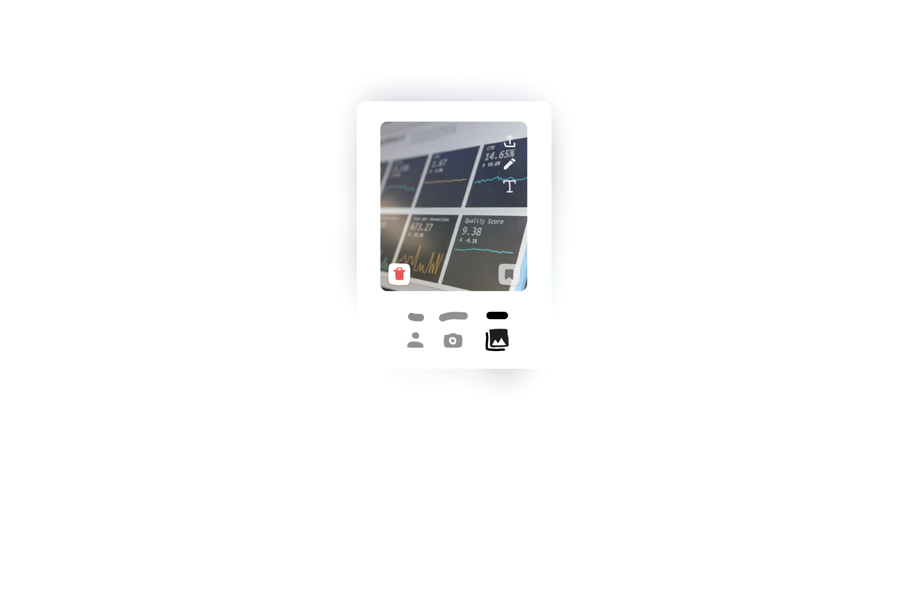
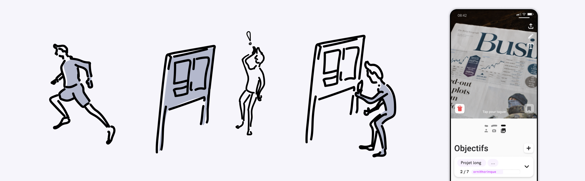

# Photobook

 

- ### Team
- [Théo Geiller / Product design](#)
- [Raphaël Perraud / Product design](#)

- ### Timeline
- Février 2020 - June 2020

- ### Role
- User research
- Product design

- ### Tools
- Paper / pencil
- Figma

- ### Methodology
- Experimentation
- Litterature review
- 

An application based on the smartphone camera that seeks to improve the real-world observations that students can make.

 ---

# Brief

Create a service/product that takes into account the learning constraints and new uses of digital technology for students. this experience must be in line with the identity of "L'École de Design Nantes Atlantique" and its values.

# Context

Pupils take a lot of pictures with their smartphone and accumulate different types of images in their gallery.

These images can be a memo, a moment, a memory, a reminder.

A designer is in a perpetual learning environment to understand users' habits.

> Pseudo-Serendipity : Looking for an accidental discovery
definition

# Problem

How to create a <strong>habit</strong> of <strong>observing reality</strong> by using free time to <strong>enhance it</strong> in a work context?

# Concept

Valuing the observations that we produces with our cameras

The idea is therefore to generate a new habit : take advantage of free time by encouraging people to revalue these observations taken in the form of photos in a work context.

# Process

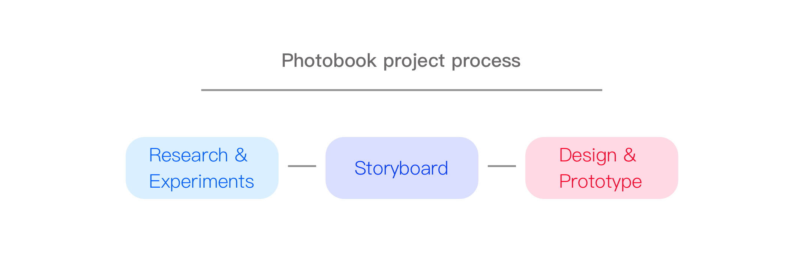

# Research

### Power of motivation

A designer need to favour the example and the concrete, which leads these receivers/collaborators/readers/teachers and himself to extend the example to a broader concept. By accumulating examples, the concept becomes more precise and more solid. these concreteness leads to an intrinsic motivation of the students in doing.

"33 bonnes pratiques en UX design" p.38-40, Liv Danthon Lefebvre, 2020

### The Hooked Model

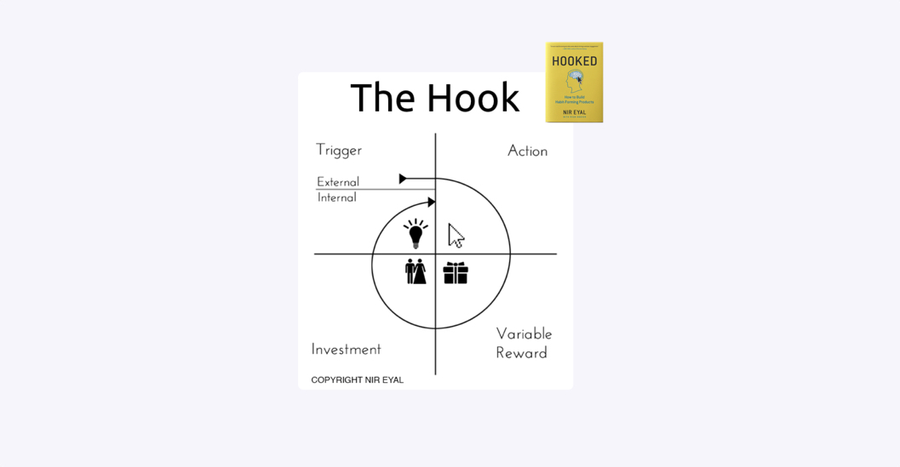

### Plan, Do, Check, Act

I had the chance to participate in the #EUvsVirus hackathon to work on a "Scrum" methodologies based learning management platform with "Scrum" methodologies for a montessori based school. This experience made me understand that a learner needs to be guided in his or her experiences and goals. <a target="_blank" href="https://selfscrum.org/en/article/whatisit/">more</a>

### Goldsmiths

it is an experimentation, they give a device aiming at documenting the daily life of the subjects, the physical tool is expressly dedicated incite to the use, it creates a link, a reminder of the use by the possession of the tool.

Personalized capture of information about yourself.

The use of the image as an account of a social experiment.

Constraints of the image on data capture.

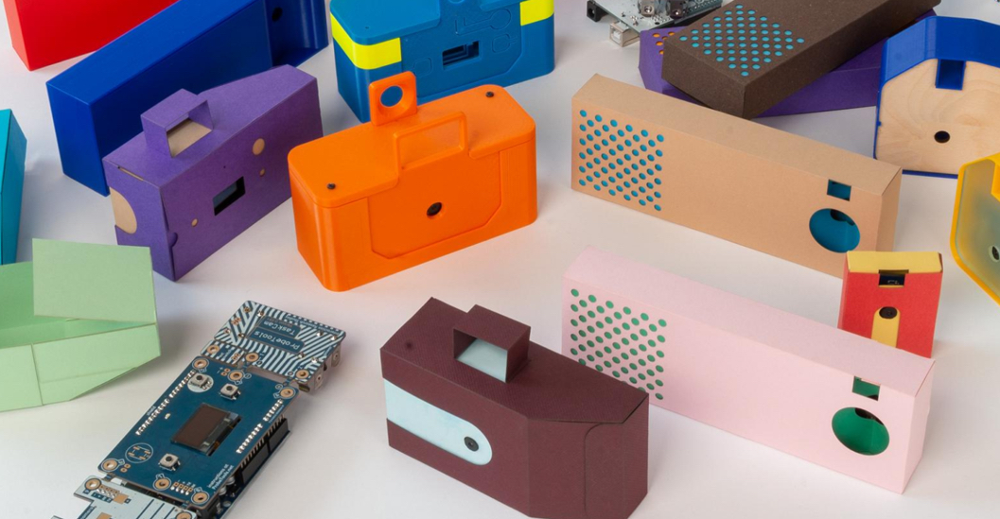

### Experiments

Full of lost used photos, I can understand other people's notes more easily. Using the photo as a reminder, list/to-do list, bookmark.

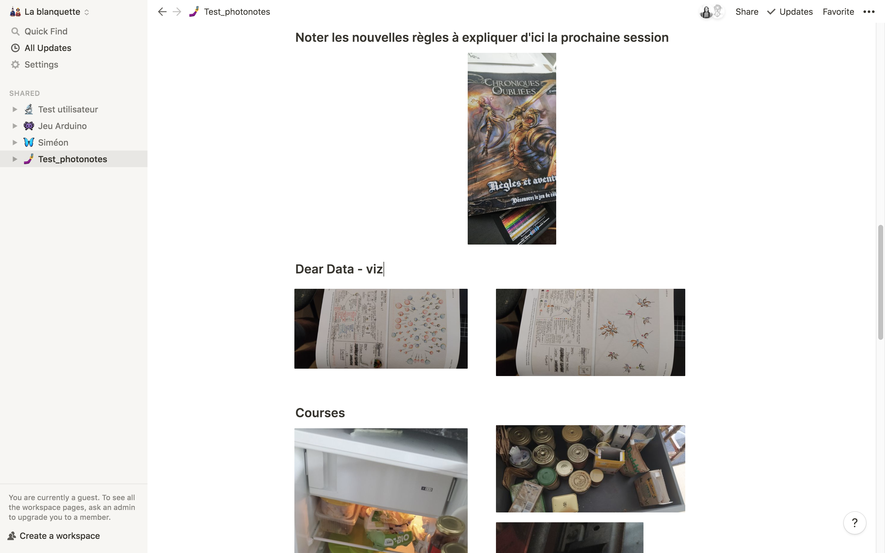

Raphael's pictures to test photo observations

# Resolution

## Problem refinement

1) Getting into the habit of taking advantage of free time.

2) Encouraging observation of reality.

3) Valuing your observations in a work context.

## userflow

To generate habits we build our userflow on the hooked model, therefore we add a lean concept, PDCA model for Plan, do, check, act this model is used for the task management on lean project these 2 model build an efficient habit.

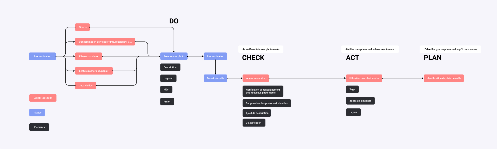
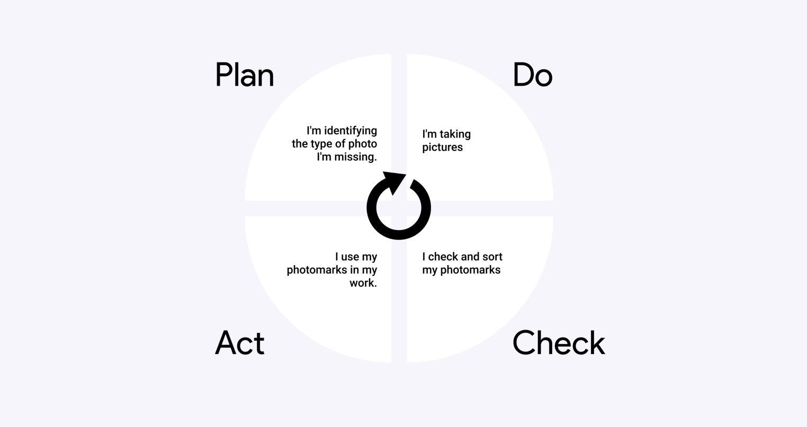

## Wireframe

Prototyping with some basic shape lead us to focus on the interaction of taking a photo with a smartphone, we are also testing photo applications such as the huji.

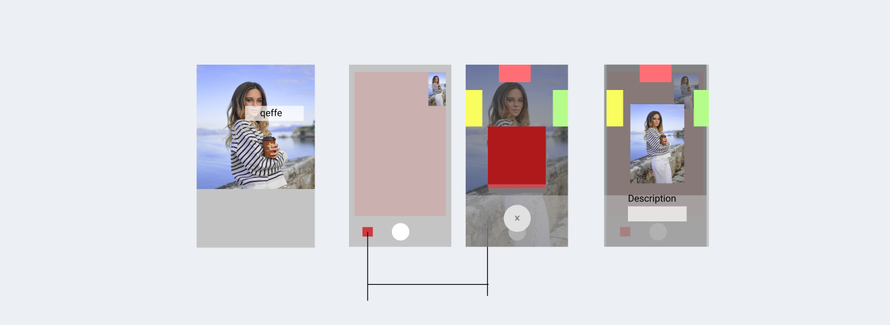

## Iteration on Figma

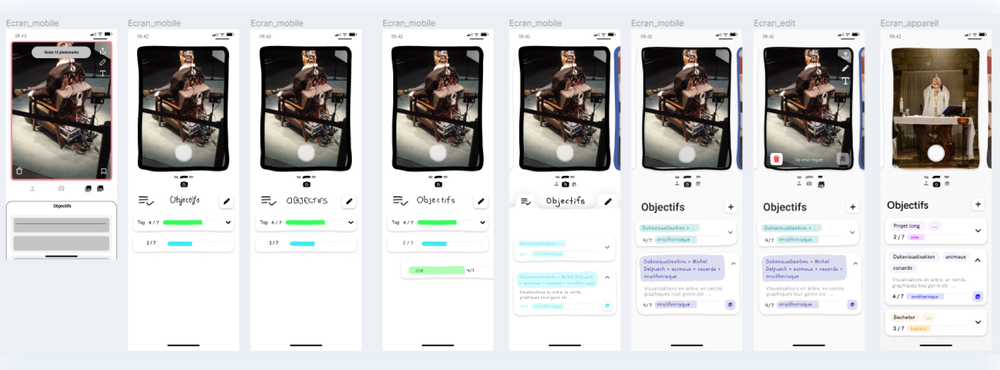

## Features

### The Photomark

Concept defining a use already practiced by users: bookmark in photo format, which therefore has the particularity of being an instantaneous "note-taking" and which can encompass both the representation of the subject as well as its description (for example: a work and the juxtaposed insert in a museum). It is thus a response to this need to observe reality.

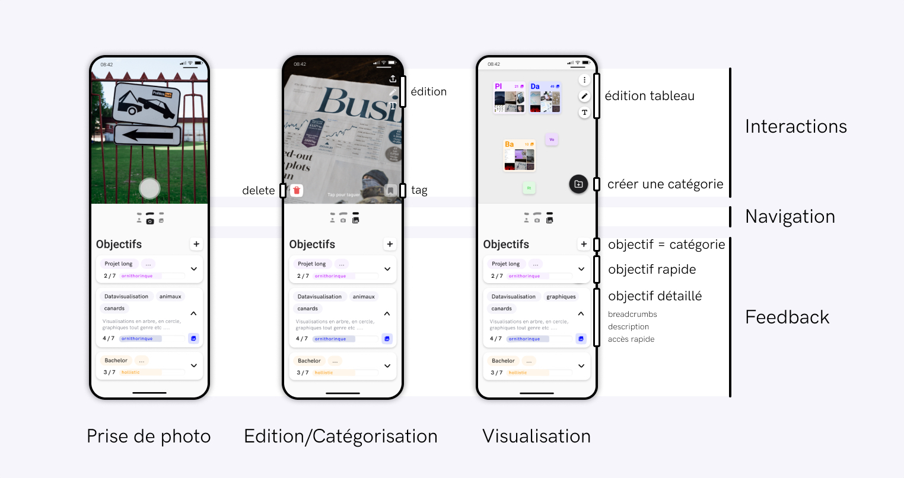

### Constructivist Procrastination

Meets the need to get into the habit of taking advantage of free time. Constructivist procrastination defines the situation where the student uses procrastination time to be in active search of meanings.

### Knowledge Space

Meets the need to enhance the value of observations in a work context thanks to the centralization on a dedicated Gallery/Application integrating a synchronization with the desktop application.

The space remains practical thanks to the hygienic storage imposed on our user: by limiting the number of photos per category to about thirty, the user is obliged to subdivide the category if he wants to continue to feed it and thus further detail his tree structure.

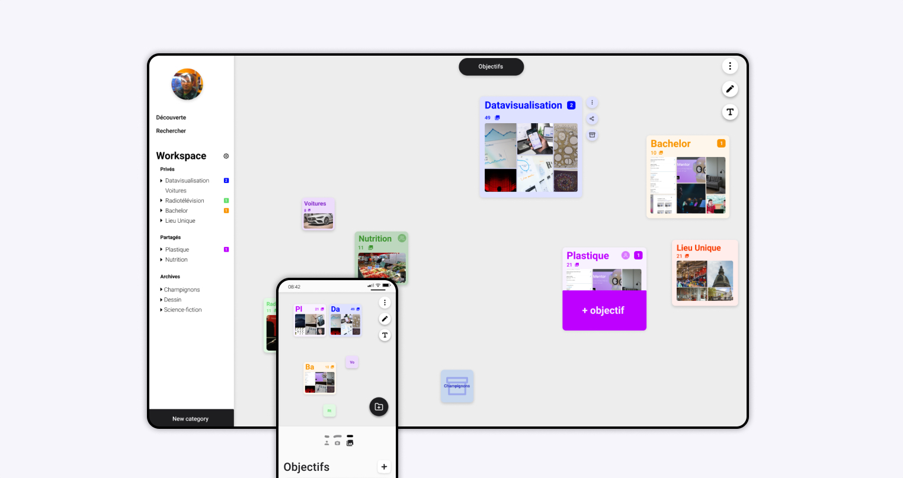

### A virtuous circle

Our platform tries to generate a habit thanks to the user path based on the Hook model: it is part of a loop based on the "Plan" "Do" "Check" "Act" model that creates a usage routine and task management.

The "Do" is done in the action of taking a photomark.

The user then comes to "Check" the collected photomarks and sort through them, eliminate undesirable/redundant ones, and categorize those kept.

Correctly categorized, these collected watch elements can then be highlighted in the work: this is the "Act" step.

The user can thus see the gaps in his collection of information from his personalized viewing space, and create objectives to complete his research already done: we go from a situation of serendipity to a pseudo-serendipity, where the user directs his leisure time according to his objectives. He "Plans" his future photomarks.

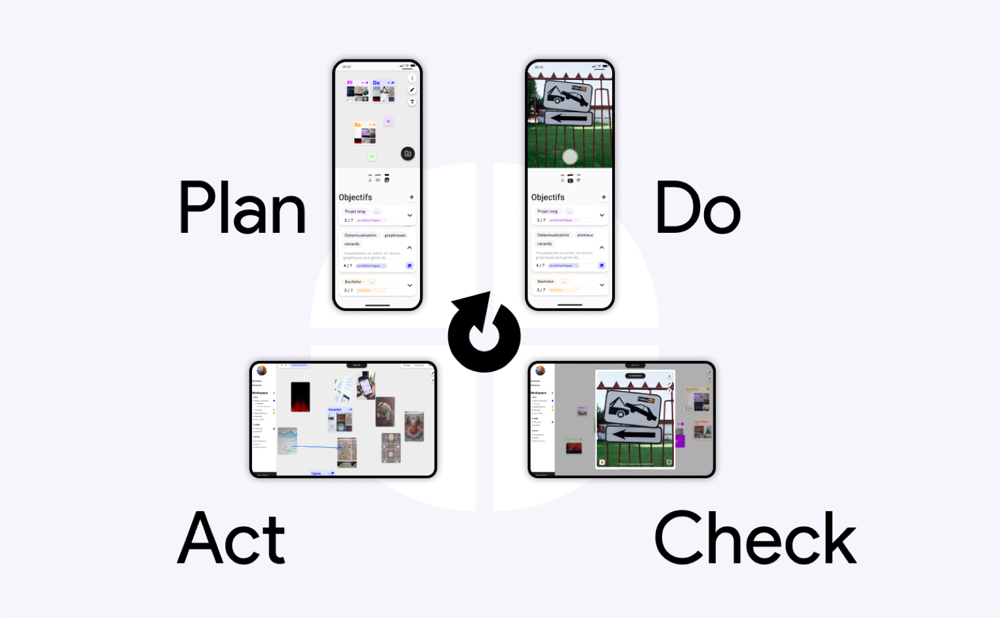

## Visual design

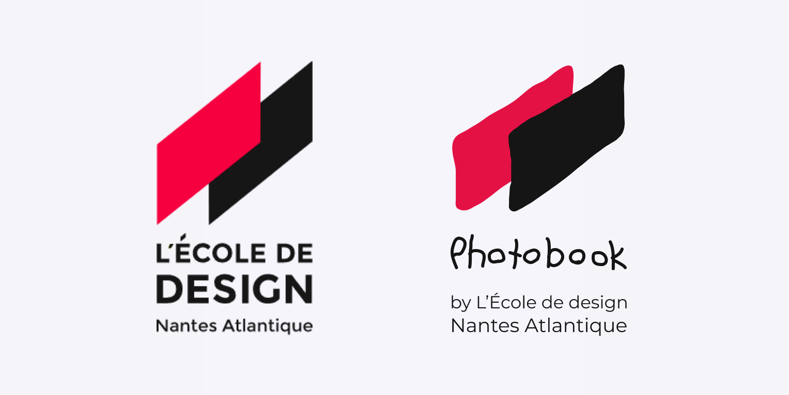

# Conclusion

in progress
