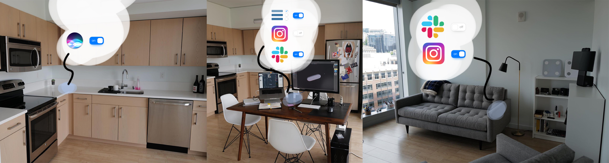

<h1 class="title">Switch to focus mode and reduce smartphone interruptions by blocking your distracting applications with a dock containing rfid technology.</h1>

- ### Team
- [Pierre-Damien Doucet / Industrial design](https://pierredoucet.com/)
- [Théo Geiller / Product design]()

- ### Timeline
- June 2020 - Now

- ### Role
- User research, prototyping, UI design

- ### Tools
- Sketch
- Principle
- After Effect
- Premiere Pro

 ---

## Context

During the containment, I managed the organization of a remote "hackathon" within the school, "HACKARANTAINE" is a hackathon on discord and my role was to make contact with mentors/potential participants, I was in charge of the whole upstream phase of the event. I then decided to participate as the rest of the collective was in charge of the event and did not need any reinforcement. After the hackarantaine I decide with an industrial design student to continue research and product design

## As a user I would like to improve my habits, to get into my workflow

being in containment we focused on our respective equipment and workspaces.

Crazy eight and dote voting during remote session

In this project, we explored how we can help people get to work more effectively through habit. Focusing specifically on the smartphone that governs many habits, which contains many tools for user routines, we realized that the phone for many people does not lead to the transition to a work state because it contains both work, staff, and relaxation. Users need to gain digital hygiene to be driven on the platforms and functionalities related to their physical actions and intentions.

Mobile use schema

## Concept

With SmartDock, we want to connect real space to digital space. Create a natural link between what you can do with our smartphone and the real life context.

<iframe class="video" width="560" height="315" src="https://www.youtube.com/embed/7p8mKIXvY3c" frameborder="0" allow="accelerometer; autoplay; encrypted-media; gyroscope; picture-in-picture" allowfullscreen></iframe>

Concept image

I made this image to demonstrate the use to our Hackarantaine mentor, <a target="_blank" href="https://alexandredeffenain.com/">Alexandre deffenain</a>

## Dock based user experience

comming soon

## Core experience

comming soon

## Device

comming soon

## Testing

comming soon

## Passive Solution

comming soon
