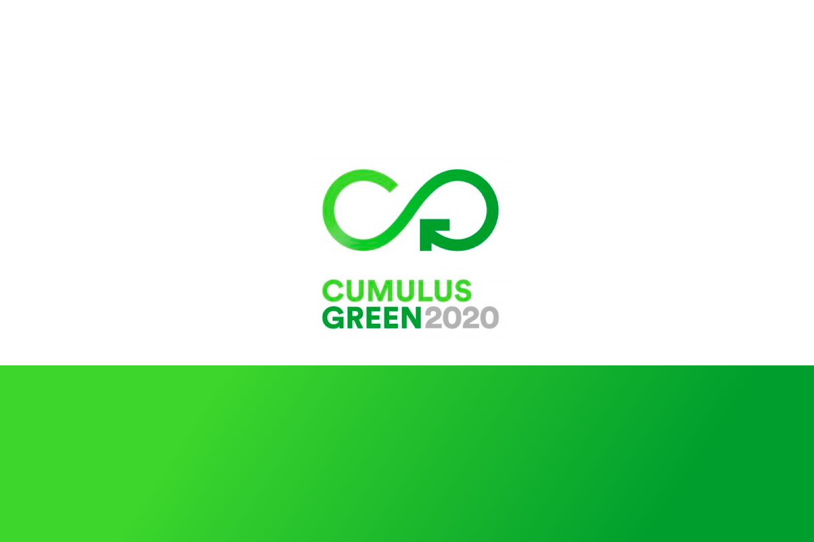

# Wewood

- ### Team 
- [Gaëtan Guillaumin / Industrial design](https://www.gaetanguillaumin.com/)
- [Clara Jouault / Industrial design](https://www.linkedin.com/in/cjouault/?originalSubdomain=fr)
- [Marie Bal-Fontaine / Industrial design](http://colossus.lecolededesign.com/mbal-fontaine/about/)
- [Ronan Chopineaux / Product design](#)
- [Théo Geiller / Product design](#)

- ### Timeline
- 2 months

- ### Role
- User research
- User experience
- User interface
- Information Architecture
 
- ### Tools
- Paper / pencil
- Sketch
- After effects
 ---
## Overview

> « 2.01 billion tones of waste produced in 2018 » 

Between 2018 and 2050, the waste quantity should increase by 70% in the world to reach 3.4 billion tones per year

## User Research

> Today the circular economy is not fully integrated in our live.

It does not follow people’s behaviours and needs.

## Our solution

## User Experience

## Object oriented user experience

## Wireframe

