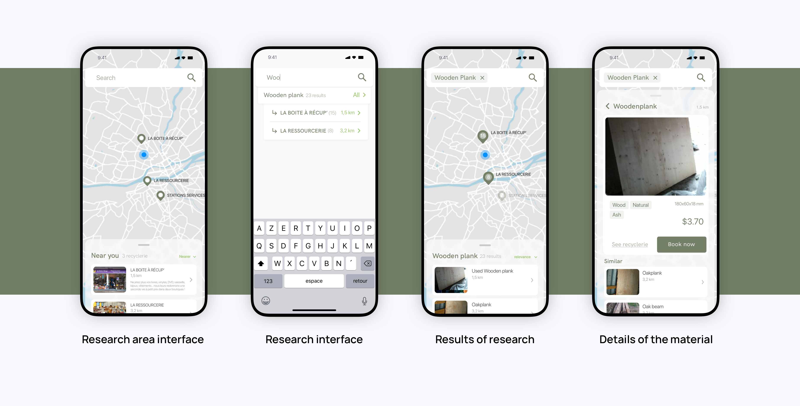

# Wewood

## Overview

I was involved with Master's Degree students in Cumulus Green 2020 competition. For this entry, the goal was to make sense of the circular economy. The goal for us was to create a platform that makes the circular economy accessible to the largest number. I took care of user interview for the product definition with the team, of the whole interface and reflection around usability. My teammates focused on economic viability, graphic choices and competition presentation

- ### Team 
- [Gaëtan Guillaumin / Industrial design](https://www.gaetanguillaumin.com/)
- [Clara Jouault / Industrial design](https://www.linkedin.com/in/cjouault/?originalSubdomain=fr)
- [Marie Bal-Fontaine / Industrial design](http://colossus.lecolededesign.com/mbal-fontaine/about/)
- [Ronan Chopineaux / Product design](#)
- [Théo Geiller / Product design](#)

- ### Timeline
- 2 months

- ### Role
- User research
- User experience
- User interface
- Information Architecture
 
- ### Tools
- Paper / pencil
- Sketch
- After effects
 ---
## Overview

> « 2.01 billion tones of waste produced in 2018 » 

Between 2018 and 2050, the waste quantity should increase by 70% in the world to reach 3.4 billion tones per year

## User Research

> Today the circular economy is not fully integrated in our live.

It does not follow people’s behaviours and needs.

## Our solution

Our solution focused on foster the use of upcycling center, improve their visibility, facilitate their storage, implement the wastes into a circular economy and encourage the initiatives

we have to think around, second hand materials instead of new ones, material availability, storage inside the upcycling centers, industrial wastes, domestic wastes and the highlight of the upcycling center values to bring more initiatives

## User Experience

To present the concept we have to focus on the search of specific material path because it's our first value

## Object oriented user experience

To present the concept we have to focus on the search of specific material path because it's our first value

## Wireframe

We make this interface and architecture with the group, we don't want to have a tab bar or nav bar. we want to have direct way to search, to see and to navigate on avaiable upcycling center and materials.

## Interface

User interface focused on search because user want to know what materials are availlable in a 

referencing all material for an upcycling center it's difficult, Centers don't have the time for this and concentrates power in market location management the interface focused on this problem and we have think a prefilled place holder for accompany the center to referencement of all products

## Word of the end

We have to focus on the referencement for the upcycling and think a better way because actually our solution can't be efficient for all upcycling center. We think about a system that permit all user to reference upcycling product.
