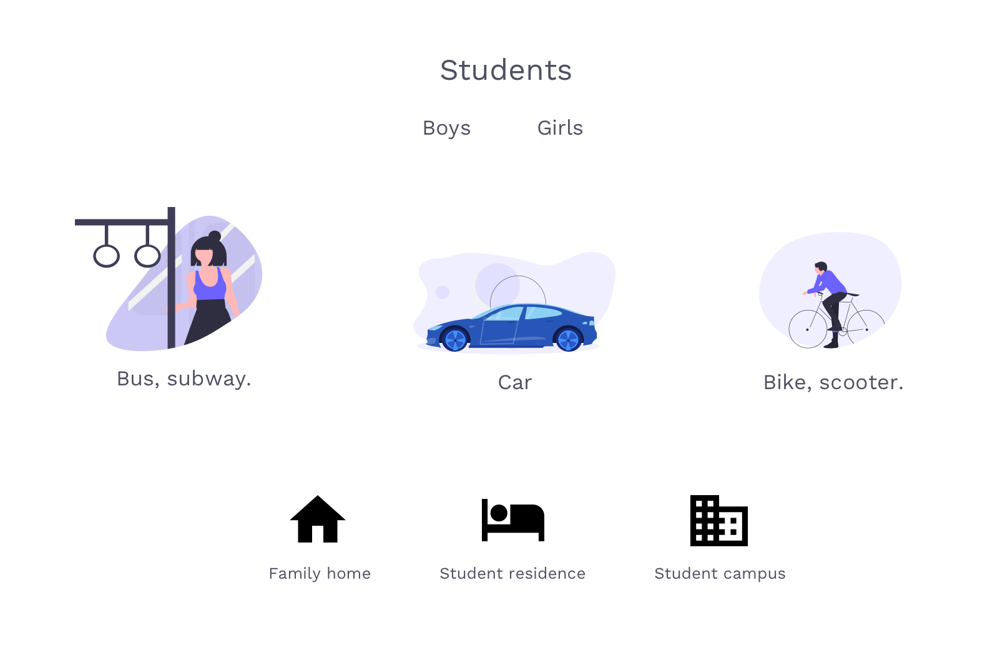
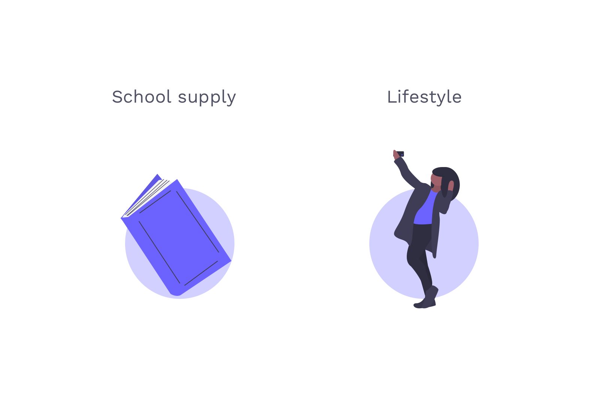
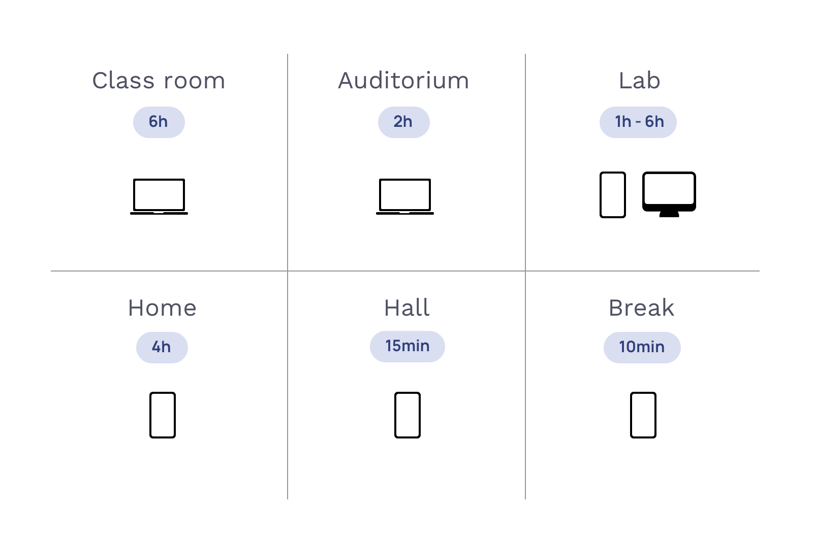
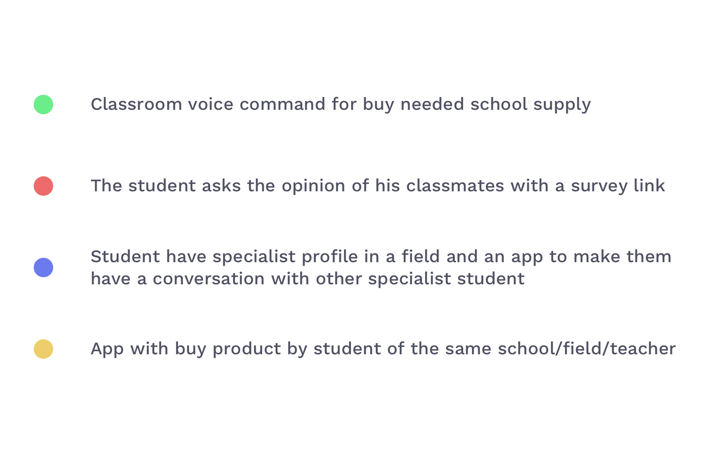
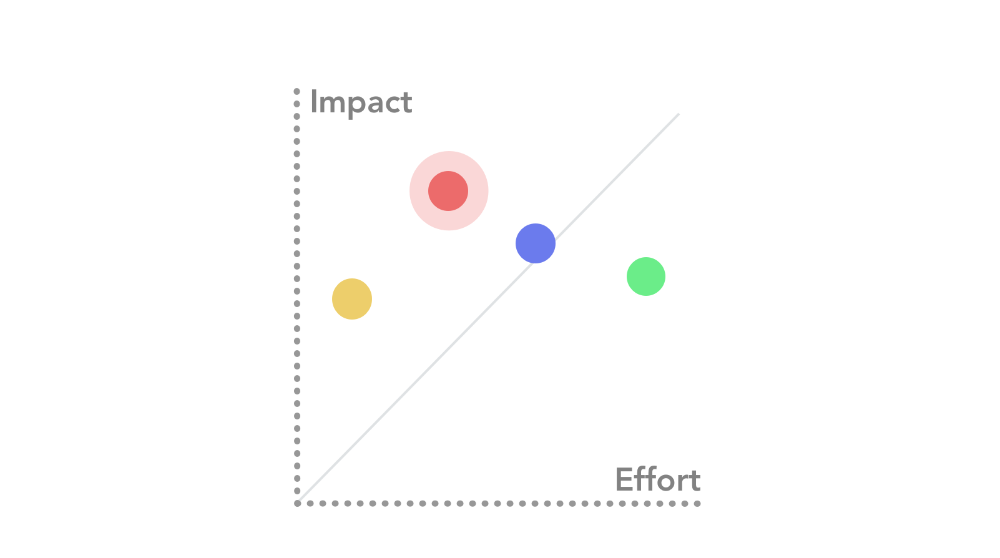
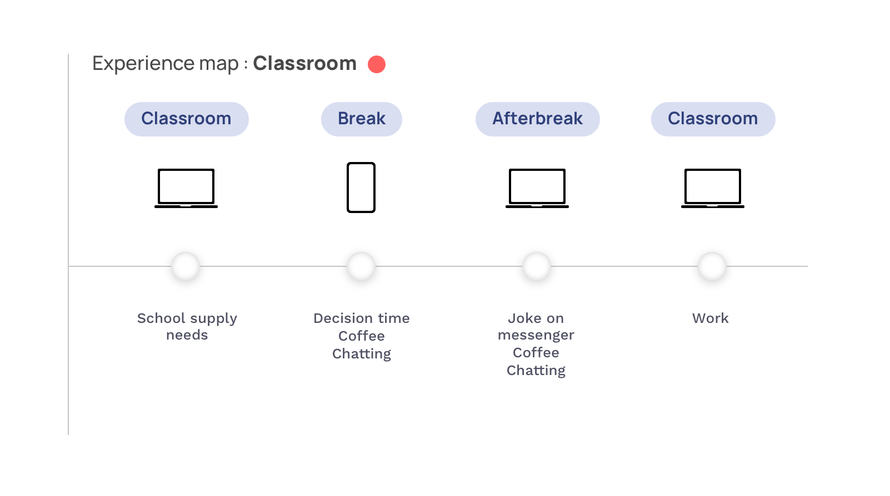

</img>

## Overview
- 2 hours
- Travel Time

## Problem
Pick a target user who don't feel is well served by Amazon.com. How would you redesign Amazon.com to appeal them? 
## WHY ?
Better serving is important for Amazon.com because of his 150 million users.
We have to trying to solve for grow user and have better experience with e-shopping.
Amazon improved life of users with fast shipping and low price on web market.

## WHO ?

## WHEN & WHERE ?

## WHAT ?

## PRIORITISE AND CHOOSE IDEA

## SOLVE

